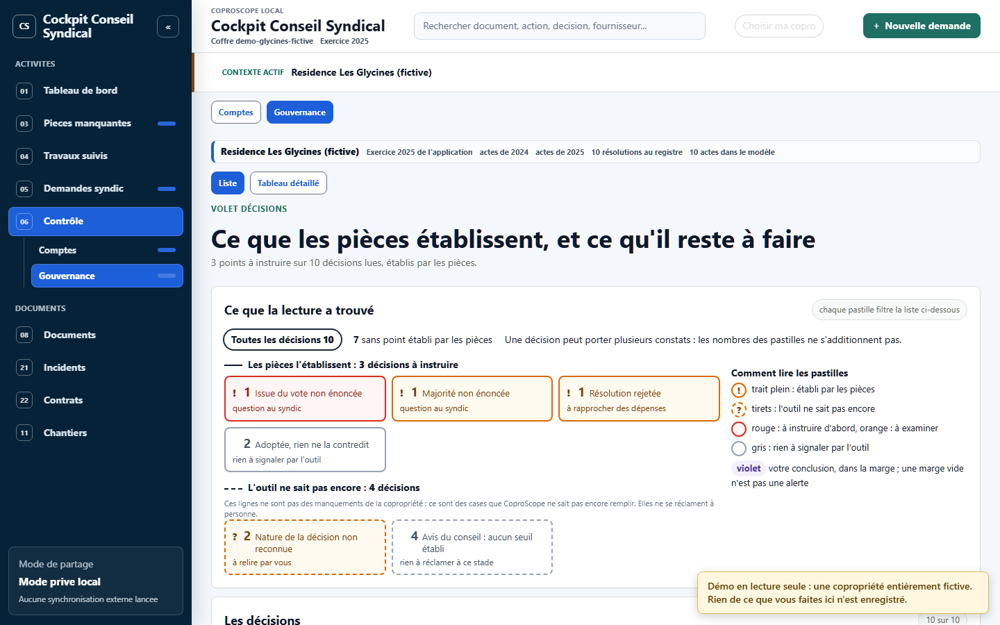

# CoproScope

**Lire le dossier de sa copropriété sans être expert : ce que les pièces
établissent, ce qui manque, et la question à poser au syndic.**

[](https://bthollet.github.io/CoproScope/)
[](https://github.com/bthollet/CoproScope/actions/workflows/ci.yml)
[](LICENSE)



> **Essayer sans rien installer :** <https://bthollet.github.io/CoproScope/>.
> La démo montre une copropriété **entièrement inventée**, en lecture seule. Commencez par
> **Contrôle › Gouvernance** et cliquez sur une pastille ([guide de la démo](docs/notes/demo.md)).

## Le problème

Dans une copropriété, l'information existe : procès-verbaux d'assemblée, devis,
factures, annexes comptables, contrats. Mais elle est dispersée, écrite pour des
spécialistes, et rarement reliée. Un conseil syndical bénévole qui veut savoir
si une dépense a été votée, si les travaux ont été réceptionnés, ou quelle pièce
réclamer, doit tout reconstituer à la main.

CoproScope lit les pièces transmises par le syndic, **sur votre ordinateur**, et
relie ce qui doit l'être : la décision, la dépense, la pièce qui la prouve, et ce
qui manque.

## Pour qui, et à quel stade

- **Pour un conseil syndical** qui veut lire le dossier transmis par son syndic.
- **Version de travail (alpha).** Deux écrans sont solides, les autres sont partiels ou à
  construire ; l'interface a beaucoup changé en septembre 2026.
- **Sans être informaticien, la porte d'entrée est la [démo en ligne](https://bthollet.github.io/CoproScope/).**
  Lancer CoproScope sur ses propres documents demande aujourd'hui une installation
  technique ; aucun programme prêt à télécharger n'est proposé.
- **Mis au point sur les pièces réelles de deux cabinets de syndic**, qui ne sont pas publiées.
  La démo, elle, ne prouve que le fonctionnement de la chaîne.
- **Projet porté bénévolement**, à partir d'un besoin réel de conseil syndical. Pour écrire :
  les *issues* du dépôt (un compte GitHub est nécessaire).

## Ce que fait l'application aujourd'hui

| Écran | Ce qu'il fait | État |
|---|---|---|
| **Contrôle › Gouvernance** | liste les décisions d'assemblée ; distingue ce que les pièces établissent de ce que l'outil ne sait pas | branché sur le dossier |
| **Contrôle › Comptes** | rapproche chaque dépense de ce qui l'autorise et la prouve | partiel ; vide sur la démo, qui n'a pas encore d'état des dépenses |
| **Documents** | explorateur des pièces classées ; aucune pièce perdue faute de classement | branché sur le dossier |
| **Pièces manquantes, Demandes au syndic** | ce qui manque, ce qui a été demandé | partiel |
| **Travaux, Incidents, Contrats** | le suivi d'une opération, des sinistres, des échéances | partiel ; Travaux est un écran d'exemple |
| **Tableau de bord, Chantiers** | la synthèse | à construire |

Le détail de chaque écran, avec ce qui reste à faire, est dans la
[carte des notes](docs/notes/carte.md). Une extension de navigateur séparée,
l'[observateur d'extranet](docs/notes/fonction-observateur-extranet.md), note ce
que l'extranet du syndic publie au fil du temps.

**Ce que CoproScope n'est pas :** ni un syndic, ni une comptabilité officielle,
ni un avis juridique. Le contrôle des décisions ne conclut pas à la conformité : il dit
ce que les pièces établissent, et ce qu'il n'a pas pu établir. L'écran Comptes porte
encore un libellé « Conforme avec preuve », à reprendre.

## Feuille de route

<picture>
  <source media="(prefers-color-scheme: dark)" srcset="docs/assets/vitrine-2026-09-13/frise-feuille-de-route-sombre.png">
  
</picture>

La lecture courte est dans la [feuille de route](docs/notes/feuille-de-route.md). Le
registre de travail de l'équipe, plus technique, est
[`docs/roadmap_backlog_central.md`](docs/roadmap_backlog_central.md).

Plusieurs idées sont pensées mais **n'ont pas d'écran** : elles sont décrites comme
concepts, sans être présentées comme livrées.

| Concept | Note |
|---|---|
| Plusieurs membres du conseil sur un même dossier | [multi-utilisateur et coffre partagé](docs/notes/concept-multi-utilisateur-coffre-partage.md) |
| Préparer une assemblée générale | [préparation d'AG](docs/notes/concept-preparation-ag.md) |
| Partager un document en masquant ce qui doit l'être | [diffusion et masquage](docs/notes/concept-diffusion-masquage.md) |
| Partager par un transport chiffré | [synchronisation chiffrée](docs/notes/concept-synchro-drive.md) |
| Garder une copie vérifiable d'archives détenues par un tiers | [archives détenues par un tiers](docs/notes/concept-archives-anti-retention.md) |
| Transmettre les archives d'un syndic à l'autre | [passation entre syndics](docs/notes/concept-passation-syndics.md) |

## Le droit, jusque dans le code

Quand un contrôle s'appuie sur un texte de loi, **le code dit quel article a été lu,
dans quelle version, et quand** : un même article change au fil des réformes. Le
contrôle cite une clé ; la clé renvoie à l'un des deux registres des sources, qui
porte l'identifiant Légifrance, la version et la date de lecture. Un test refuse tout
nouvel identifiant Légifrance absent de ces registres.

Cette garde ne voit pas tout, et c'est écrit : 28 identifiants restent recopiés en dur
dans le code, dont 19 ne figurent dans aucun registre ; elle ne lit que les fichiers
Python, et un article cité en toutes lettres lui échappe. La chaîne complète, sur un
exemple du dépôt : [le droit, jusque dans le code](docs/notes/ancrage-reglementaire.md).

## Confidentialité

- **L'interface travaille sur votre poste.** Pas de compte, pas de serveur distant,
  aucune synchronisation depuis l'écran. Des commandes expérimentales d'envoi vers
  Google Drive existent en ligne de commande : elles demandent un module que
  l'installation ci-dessous n'inclut pas, et une connexion à un compte Google.
- **La chaîne n'écrit pas dans les pièces d'origine** : ce qu'elle calcule va dans des
  dossiers à côté. C'est une règle du code, pas un verrou du système.
- **Le masquage automatique n'est pas promis.** Un document que l'on partage doit
  être relu par un humain.
- **Vos données restent votre responsabilité.** Un dossier de copropriété contient des
  données personnelles d'autres copropriétaires : CoproScope les garde sur votre poste,
  mais la sécurité de ce poste et la durée de conservation vous reviennent.
- **Aucune pièce réelle dans ce dépôt de code.** La démo et les captures viennent d'une
  copropriété inventée. Côté mainteneur, un contrôle à activer refuse d'envoyer sur
  GitHub un fichier texte qui porte un terme d'une liste tenue hors du dépôt (sans cette
  liste, il refuse tout envoi) ; il ne lit ni les images ni les PDF, et ne cherche pas
  les chemins locaux.

Ce que ces garanties laissent exposé est écrit dans la note
[confidentialité](docs/notes/confidentialite.md).

## Installer et lancer

Pour les personnes à l'aise avec un terminal : Python 3.11 ou plus récent et Git. Ces
commandes récupèrent le code, fabriquent la copropriété fictive de la démo dans un
dossier voisin, la font lire par la chaîne, puis ouvrent l'interface complète :

```bash
git clone https://github.com/bthollet/CoproScope.git
cd CoproScope
python -m venv server/.venv
server/.venv/bin/python -m pip install -e "server[ui,accounting]"
server/.venv/bin/python tools/pool_fictif/generer.py ../demo-glycines
server/.venv/bin/coprocs pipeline run --instance-root ../demo-glycines
server/.venv/bin/coprocs ui open-test --instance-root ../demo-glycines
```

Sous Windows, remplacer `server/.venv/bin/` par `server\.venv\Scripts\`. L'adresse
locale s'affiche avec son jeton de session ; `Ctrl+C` arrête le serveur. Tests,
architecture, exécutable Windows et règles de contribution :
[développer](docs/notes/developper.md) et [architecture](docs/notes/architecture.md).

## Soutenir

Essayer la démo et dire ce qui n'est pas clair, relire un contrôle juridique,
contribuer du code : [soutenir le projet](docs/notes/soutenir.md).

## Licence

[AGPL-3.0-only](LICENSE), sauf mention contraire pour un fichier tiers.
