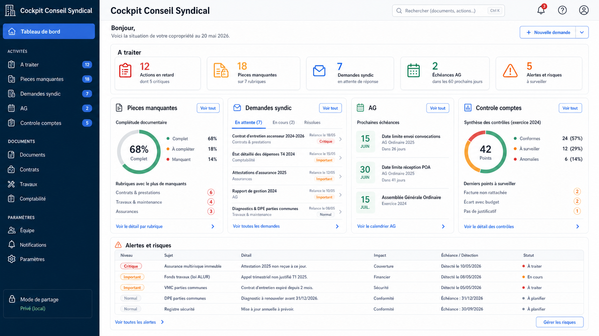
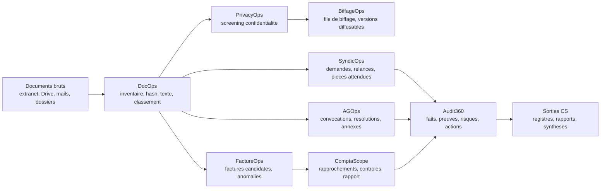
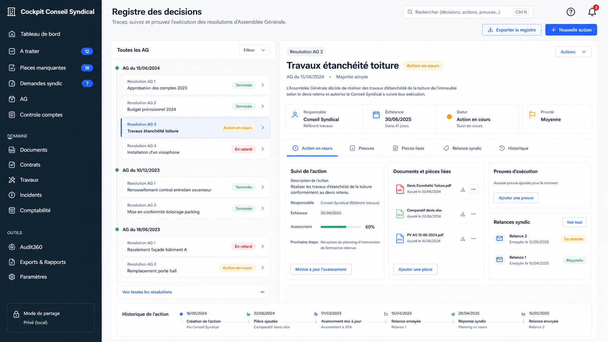
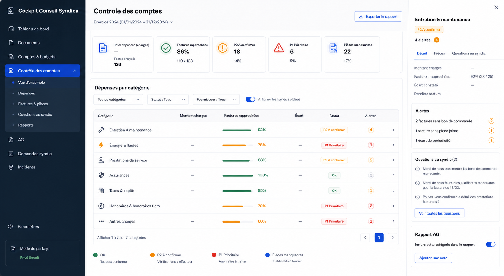
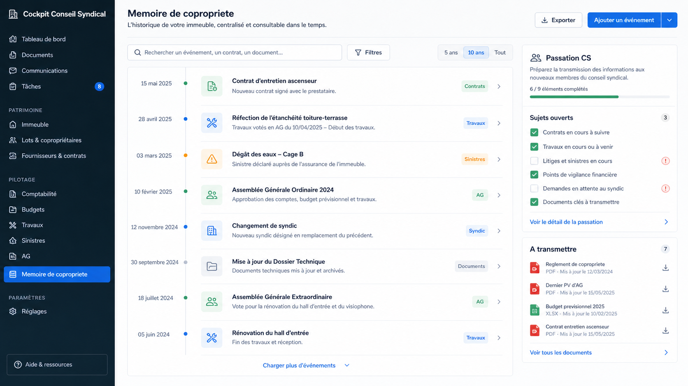

# CoproScope

> Reprendre la main sur une copropriete sans devenir syndic, sans perdre les preuves, sans exposer les donnees sensibles.

CoproScope est un cockpit local-first pour conseils syndicaux. Il transforme un fonds documentaire disperse en matiere de travail lisible, probatoire et actionnable : documents, demandes au syndic, assemblees generales, factures, comptes, controles, biffages et restitutions.

Ce n'est pas un extranet de plus. Ce n'est pas un logiciel de syndic officiel. C'est une couche de **preuve + action + memoire** pour les equipes de conseil syndical qui veulent comprendre, verifier, relancer, transmettre et diffuser proprement.

Promesse structurante : la memoire collective ne doit pas etre confisquable. A terme, chaque coproprietaire doit pouvoir telecharger l'archive complete, verifier son integrite, reconstruire ce qui lui est ouvert, et conserver la preuve que les compartiments sensibles existent sans pouvoir les lire sans les cles requises.



## Pourquoi CoproScope existe

Dans beaucoup de coproprietes, le probleme n'est pas seulement l'absence d'information. C'est plutot que l'information est :

- eparpillee entre extranet, Drive, mails, dossiers locaux et pieces papier ;
- difficile a relier a une decision, une depense, une demande ou une preuve ;
- rarement transformee en action suivie ;
- fragile lors des changements de membres du conseil syndical ;
- parfois confisquee ou perdue quand une personne, un compte cloud ou un groupe detient seul la memoire ;
- sensible a partager, parce qu'elle contient parfois des donnees personnelles, financieres ou contentieuses.

L'etude utilisateurs 2026 confirme un point simple : les conseils syndicaux n'ont pas seulement besoin de "voir des documents". Ils ont besoin de savoir **quoi faire maintenant**, **avec quelle preuve**, **dans quel role**, **sans se surexposer**.

Lire la synthese : [Etude utilisateurs](./docs/etude_utilisateurs.md).

## Ce que CoproScope aide a faire



## Ce qui existe deja

| Bloc | Etat | Ce que ca fait aujourd'hui |
|---|---|---|
| CLI `coprocs` | Solide | Point d'entree local pour lancer les traitements. |
| Instance synthetique | Solide | Exemple public non sensible pour tests et demonstrations. |
| DocOps | Deja exploitable | Inventaire, hash, extraction texte, classement, completude, KPI. |
| PrivacyOps | Nouveau socle | Screening confidentialite, colleges d'acces, risques d'exposition. |
| BiffageOps | Nouveau socle | File de biffage, biffage local de documents texte/PDF/DOCX selon disponibilites. |
| SyndicOps | Embryon utile | Registre de demandes, pieces attendues, relances et preuves a epaissir. |
| FactureOps | Amorce v1 | Factures candidates, anomalies de piece, intensite d'outil `L0` a `L4`. |
| ComptaScope | Amorce v1 forte | Rapprochements facture/etat des depenses, priorites `OK`/`P2`/`P1`, rapport explicatif. |
| AGOps | Premiere version | Reperage des documents AG, resolutions, annexes et points d'attention. |
| DecisionOps | Amorce v1 | Registre decisions-actions-preuves depuis les resolutions AG et les preuves locales candidates. |
| IncidentOps | Amorce v1 | Registre incidents, statuts, prochaines actions, preuves de cloture et export des ouverts. |
| Audit360 | Couche transverse | Constats normalises, controles, preuves attendues, actions et diligences. |
| GristOps / EvidenceOps | Local | Exports vers tableaux locaux et rapports reproductibles. |
| `share-audit` / `share-export` | Solide | Frontiere public/prive pour publier seulement le genericisable. |

## Ce qui n'existe pas encore

| Sujet | Etat clair |
|---|---|
| Application web locale | V0 livree : cockpit local `coprocs ui open-test`, branche sur les artefacts existants et affiche les chantiers. |
| Experience grand public complete | Pas encore. La priorite actuelle reste le conseil syndical implique. |
| Registre decision -> action -> preuve | Amorce v1 livree ; reste a brancher dans l'interface et les workflows demandes/travaux. |
| WorksOps travaux/devis/reception | Cible prioritaire, pas encore livre. |
| IncidentOps sinistres/signalements | Amorce v1 livree ; reste a enrichir et raccorder a WorksOps/contrats/assurance. |
| ContractOps contrats/obligations | Cible ulterieure. |
| CommsOps syntheses diffusables | Cible ulterieure, deja preparee par les sorties. |
| SaaS multi-tenant | Non prioritaire. Le cap reste local-first. |
| Vote electronique complet | Non prioritaire : le besoin fort est plutot preparation et suivi post-AG. |
| Chatbot IA autonome | Non souhaite sans sources citees et validation humaine. |

## Les concepts UX cibles

L'etude utilisateurs propose quatre directions d'interface. Elles ne sont pas encore le produit, mais elles montrent la forme souhaitable.

### 1. Cockpit conseil syndical

Une vue priorisee : demandes en retard, pieces manquantes, echeances AG, controles comptes, alertes.


### 2. Registre decisions, actions, preuves

Chaque resolution d'AG devient une action suivie, reliee aux pieces, relances, preuves et historiques.



### 3. Controle des comptes guide

ComptaScope devient lisible pour un conseil syndical : rapprochements, `P1`, `P2`, questions au syndic, rapport AG.



### 4. Memoire de copropriete

Une ligne de vie de l'immeuble : contrats, travaux, sinistres, AG, decisions, passation du conseil syndical.



## Feuille de route produit

La feuille de route issue de l'etude utilisateurs est volontairement simple :

1. rendre visibles les forces actuelles : DocOps, PrivacyOps, SyndicOps, ComptaScope, AGOps, DecisionOps, IncidentOps, Audit360 ;
2. raccorder le registre **decision -> action -> preuve** aux demandes, travaux et preuves ;
3. epaissir WorksOps, ContractOps et CommsOps ;
4. enrichir l'interface locale sobre a mesure que les objets metier se stabilisent ;
5. garder les outils avances CLI/DuckDB/Grist/Evidence pour les publics experts, sans en faire l'entree principale.

Details : [Feuille de route](./docs/feuille_de_route.md).

## Demarrage rapide

Depuis le dossier [`server/`](./server) :

```powershell
python -m venv .venv
.\.venv\Scripts\python.exe -m pip install -e ".[ui]"
```

Puis, a la racine du depot :

```powershell
.\server\.venv\Scripts\python.exe -m coproscope.cli doctor --instance-root .\examples\synthetic_copro
.\server\.venv\Scripts\python.exe -m coproscope.cli pipeline run --instance-root .\examples\synthetic_copro
.\server\.venv\Scripts\python.exe -m coproscope.cli privacy screen-existing --instance-root .\examples\synthetic_copro
.\server\.venv\Scripts\python.exe -m coproscope.cli privacy redaction-queue --instance-root .\examples\synthetic_copro
.\server\.venv\Scripts\python.exe -m coproscope.cli invoices extract --instance-root .\examples\synthetic_copro --year 2025
.\server\.venv\Scripts\python.exe -m coproscope.cli accounting reconstruct --instance-root .\examples\synthetic_copro --year 2025
.\server\.venv\Scripts\python.exe -m coproscope.cli accounting controls --instance-root .\examples\synthetic_copro --year 2025
.\server\.venv\Scripts\python.exe -m coproscope.cli grist sync --instance-root .\examples\synthetic_copro --dataset demo --year 2025
.\server\.venv\Scripts\python.exe -m coproscope.cli evidence build --instance-root .\examples\synthetic_copro --dataset demo --year 2025
.\server\.venv\Scripts\python.exe -m coproscope.cli demo build --source-instance-root .\examples\synthetic_copro --output-instance "$env:USERPROFILE\Documents\CoproScope\instances\demo_fictive_tilleuls" --mode fictive --year 2025
.\server\.venv\Scripts\python.exe -m coproscope.cli decisions build --instance-root .\examples\synthetic_copro
.\server\.venv\Scripts\python.exe -m coproscope.cli incidents build --instance-root .\examples\synthetic_copro
.\server\.venv\Scripts\python.exe -m coproscope.cli ui open-test --instance-root "$env:USERPROFILE\Documents\CoproScope\instances\demo_fictive_tilleuls" --year 2025 --port 8765
.\server\.venv\Scripts\python.exe -m coproscope.cli share-audit --repo-root . --config .\server\src\coproscope\configs\github_sharing.default.yml
```

`ui open-test` lance le serveur au premier plan dans le terminal visible, affiche l'URL tokenisee, et s'arrete avec `Ctrl+C`. C'est le chemin recommande pour une demonstration locale compatible antivirus. `ui serve` reste disponible comme commande bas niveau.

Par defaut, `privacy screen-existing` scanne le brut, les zones restreintes et, sauf `--skip-generated`, les sorties/staging. Pour auditer aussi les dossiers metier deja classes (`100_`, `220_`, `230_`, etc.), utiliser explicitement `--scan-workspace-prefixes`. Pour nettoyer un registre qui avait ete trop large, ajouter `--prune-unseen`.

Pour fabriquer un export public propre :

```powershell
.\server\.venv\Scripts\python.exe -m coproscope.cli share-export --repo-root . --config .\server\src\coproscope\configs\github_sharing.default.yml --output-dir ..\public-export --clean
```

## Parcours de lecture

Si tu as 5 minutes :

- [Etude utilisateurs](./docs/etude_utilisateurs.md)
- [Concept et philosophie](./docs/concept_et_philosophie.md)
- [Etat du developpement](./docs/etat_du_developpement.md)

Si tu veux comprendre le produit :

- [Fonctions cibles](./docs/fonctions_cibles.md)
- [Feuille de route](./docs/feuille_de_route.md)
- [Architecture et flux](./docs/architecture_et_flux.md)
- [Confidentialite et biffage](./docs/confidentialite_et_biffage.md)
- [Audit360](./docs/audit360.md)

Si tu veux contribuer :

- [Plan d'implementation](./docs/implementation_plan.md)
- [Orchestration multi-agents](./docs/orchestration_agents.md)
- [Lots paralleles approfondis](./docs/lots_paralleles.md)
- [Politique de partage GitHub](./docs/github_sharing.md)
- [Instance synthetique](./examples/synthetic_copro/)

## Principes non negociables

- Les documents reels restent hors depot public.
- Les originaux ne sont pas modifies.
- Les sorties doivent citer leurs sources.
- Les donnees sensibles doivent etre detectees, protegees ou biffees avant diffusion.
- Les traitements IA peuvent aider, mais ne remplacent pas la preuve ni la validation humaine.
- Les contributions publiques doivent etre genericisees.

## Structure du depot

- [`server/`](./server) : code produit, CLI, MCP minimal, schemas, configs, prompts, templates et tests.
- [`docs/`](./docs) : vision produit, etude utilisateurs, feuille de route, architecture, fonctions cibles, etat d'avancement.
- [`examples/synthetic_copro/`](./examples/synthetic_copro) : instance publique non sensible pour tests et demonstration.

Les donnees reelles de copropriete, secrets, exports OCR prives, journaux locaux, cartes de biffage et sorties generees n'ont pas leur place dans ce depot public.
