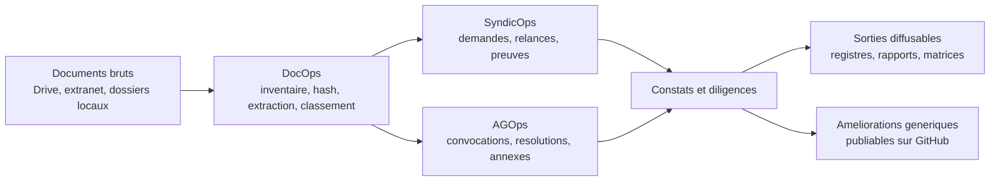

# CoproScope

> Cockpit documentaire et operationnel local-first pour conseils syndicaux exigeants.

CoproScope aide un conseil syndical a reprendre la main sur ses pieces, ses demandes au syndic, sa preparation d'assemblee generale et ses constats, sans envoyer son fonds documentaire prive dans un SaaS opaque.

## Le concept

CoproScope n'est pas un simple dossier bien range. C'est une chaine de travail qui transforme un ensemble de documents heterogenes en matiere exploitable pour piloter une copropriete:

- on inventorie sans toucher aux originaux ;
- on extrait ce qui est lisible et on signale ce qui demande un OCR ;
- on classe, on relie, on historise ;
- on produit des registres, des rapports et des diligences actionnables ;
- on ne remonte vers GitHub que ce qui est vraiment genericisable.

## La philosophie

- **Local-first** : les documents reels restent au plus pres de leur espace prive.
- **Probatoire avant decoratif** : on privilegie les traces, les preuves, les liens documentaires et les journaux d'action.
- **Francophone par defaut** : la langue de travail, les surfaces fonctionnelles et la documentation visent le francais chaque fois que c'est pertinent.
- **Generalisation sans fuite** : on se sert d'instances privees pour apprendre, puis on extrait seulement le reusable.
- **Incremental** : on part d'un socle utile tout de suite, puis on elargit.

## Fonctions cibles

- **DocOps** : inventaire, hash, doublons, extraction texte, classement, completude documentaire.
- **SyndicOps** : registre des demandes, pieces attendues, reponses, relances, chaines de preuve.
- **AGOps** : preparation d'AG, resolutions, annexes, majorites, points d'attention, suivi post-AG.
- **A venir** : ContractOps, WorksOps, CommsOps, une fois le socle documentaire et les journaux stabilises.

## Etat du developpement

- le depot public `CoproScope` est initialise ;
- la CLI `coprocs` couvre deja le premier pipeline utile ;
- une instance synthetique publique permet de valider les comportements sans expose de donnees privees ;
- la frontiere public/prive est outillee avec `share-audit` et `share-export` ;
- la francophonie devient une regle explicite de parametrage, de documentation et de surface utilisateur.

## Documentation

- [Plan d'implementation](./docs/implementation_plan.md)
- [Concept et philosophie](./docs/concept_et_philosophie.md)
- [Fonctions cibles](./docs/fonctions_cibles.md)
- [Etat du developpement](./docs/etat_du_developpement.md)
- [Politique de partage GitHub](./docs/github_sharing.md)
- [Index de la documentation](./docs/README.md)

## Structure du depot

- [`server/`](./server) : code produit, CLI, MCP minimal, schemas, configs, prompts, templates et tests.
- [`docs/`](./docs) : vision, contrats, mode d'emploi de contribution, etat d'avancement.
- [`examples/synthetic_copro/`](./examples/synthetic_copro) : instance publique non sensible pour les tests et la demonstration.

Les donnees reelles de copropriete, les secrets, les exports OCR prives et les sorties generees localement n'ont pas leur place dans ce depot public.
