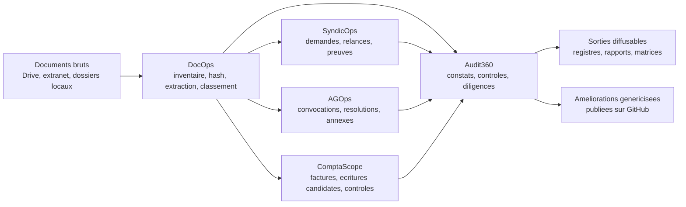

# CoproScope

> Reprendre la main sur la matiere documentaire d'une copropriete, sans sortir les pieces d'un espace prive.

CoproScope est un cockpit documentaire et operationnel local-first pour conseils syndicaux. L'idee est simple et utile: transformer un fonds documentaire disperse en base de travail lisible, probatoire et actionnable.

Autrement dit, CoproScope aide a passer de:

- "on a plein de pieces, mais personne ne sait vraiment quoi en faire"

a:

- "on sait ce qu'on a, ce qu'il manque, ce qu'il faut relancer, et ce qu'on peut diffuser proprement".



## Pourquoi ce projet existe

Dans beaucoup de coproprietes, l'information n'est pas vraiment absente. Elle est surtout:

- eparpillee ;
- mal reliee ;
- difficile a verifier ;
- rarement transformee en action propre.

CoproScope ne traite pas cela comme un simple probleme de rangement. Le projet reconstruit une **chaine documentaire**:

1. identifier les pieces ;
2. ne pas toucher aux originaux ;
3. relier documents, demandes, AG et constats ;
4. produire des sorties utiles ;
5. ne publier vers GitHub que ce qui a ete vraiment generalise.

## Ce que le projet apporte deja

Le depot public contient deja:

- un paquet `server/` avec la CLI `coprocs` ;
- un pipeline v1 exploitable ;
- une instance synthetique publique pour tester et demonstrer ;
- une premiere extraction publique de la couche **Audit360** sous forme de doc, schemas et gabarits ;
- une frontiere outillee entre **public** et **prive** via `share-audit` et `share-export` ;
- une premiere brique **ComptaScope** pour reconstruire des factures/ecritures candidates sur donnees synthetiques ;
- une couche documentaire en francais, pensee pour la lecture et la relecture.

## Ce que CoproScope cherche a construire

Pas seulement un outil qui classe des fichiers.

Plutot un systeme qui aide une equipe a:

- savoir ce qu'elle a vraiment ;
- voir ce qui manque ;
- mieux preparer ses demandes au syndic ;
- mieux preparer ses AG ;
- produire des sorties propres, relisibles et partageables ;
- faire remonter progressivement dans le depot public ce qui devient vraiment reusable.

## Les blocs fonctionnels cibles

- **DocOps** : inventaire, hash, doublons, extraction texte, classement, completude.
- **SyndicOps** : registre des demandes, pieces attendues, relances, chaines de preuve.
- **ComptaScope** : factures, fournisseurs, comptes candidats, controles, exports DuckDB/Grist/Evidence.
- **AGOps** : preparation d'assemblee generale, resolutions, annexes, majorites, points d'attention.
- **Audit360** : couche transverse de constats, points de controle, preuves attendues, actions et diligences.
- **Ensuite** : ContractOps, WorksOps et CommsOps, une fois le socle documentaire stabilise.

## Ce que le projet privilegie

- **local-first** : les documents reels restent dans leur espace prive ;
- **probatoire** : les traces et journaux priment sur les effets de manche ;
- **francophone par defaut** : quand c'est utile, les surfaces produit et la documentation parlent francais ;
- **incremental** : on livre des couches utiles, pas un systeme total abstrait ;
- **generalisation sans fuite** : une instance reelle sert a apprendre, le depot public sert a partager proprement.

## Positionnement IA

Pour l'instant, CoproScope s'appuie de maniere pragmatique sur des agents IA grand public et peu chers quand cela aide a accelerer l'analyse et la production.

Mais l'architecture accumule volontairement un maximum de briques locales:

- inventaire ;
- hash et registres ;
- extraction texte native ;
- regles documentaires ;
- zones de travail separees ;
- exports publics propres.

Le cap est clair: rendre possible, a terme, un deploiement d'IA mieux maitrise, jusqu'a des usages hors ligne lorsque le contexte, le niveau de sensibilite ou les contraintes d'hebergement l'exigeront.

## Demarrage rapide

Depuis le dossier [`server/`](./server):

```powershell
python -m venv .venv
.\.venv\Scripts\python.exe -m pip install -e .
```

Puis, a la racine du depot:

```powershell
.\server\.venv\Scripts\python.exe -m coproscope.cli doctor --instance-root .\examples\synthetic_copro
.\server\.venv\Scripts\python.exe -m coproscope.cli pipeline run --instance-root .\examples\synthetic_copro
.\server\.venv\Scripts\python.exe -m coproscope.cli tools status
.\server\.venv\Scripts\python.exe -m coproscope.cli accounting reconstruct --instance-root .\examples\synthetic_copro --year 2025
.\server\.venv\Scripts\python.exe -m coproscope.cli grist sync --instance-root .\examples\synthetic_copro --dataset demo --year 2025
.\server\.venv\Scripts\python.exe -m coproscope.cli evidence build --instance-root .\examples\synthetic_copro --dataset demo --year 2025
.\server\.venv\Scripts\python.exe -m coproscope.cli share-audit --repo-root . --config .\server\src\coproscope\configs\github_sharing.default.yml
```

La reconstruction ComptaScope produit les factures candidates, les ecritures candidates, les controles, puis les rapprochements expliques avec l'etat des depenses quand une source est configuree. Le rapport local `rapport_comptascope_<annee>.md` classe chaque cas en `OK`, `P2` ou `P1`: `OK` pour les preuves locales suffisantes, `P2` pour les candidats locaux a confirmer, `P1` pour les vrais blocages sans indice suffisant. Les traitements locaux couvrent maintenant les alias repetes, les noms fournisseurs tres similaires, les divisions egales, les sommes multi-lignes et les regroupements de factures.
Les commandes de controles et d'exports verifient aussi que le rapport ComptaScope existe: pas de tables comptables exportees sans rapport explicatif local.

Pour fabriquer un export public propre:

```powershell
.\server\.venv\Scripts\python.exe -m coproscope.cli share-export --repo-root . --config .\server\src\coproscope\configs\github_sharing.default.yml --output-dir ..\public-export --clean
```

## Parcours de lecture conseille

### Si tu as 5 minutes

- [Concept et philosophie](./docs/concept_et_philosophie.md)
- [Etat du developpement](./docs/etat_du_developpement.md)

Tu ressorts avec une idee claire de la promesse produit et de sa maturite.

### Si tu as 15 minutes

- [Fonctions cibles](./docs/fonctions_cibles.md)
- [Architecture et flux](./docs/architecture_et_flux.md)
- [ComptaScope](./docs/comptascope.md)
- [Strategie gestion copro](./docs/strategie_coproscope_gestion_copro.md)
- [Audit360](./docs/audit360.md)

Tu peux deja faire une relecture utile du repo.

### Si tu veux contribuer ou challenger les choix

- [Plan d'implementation](./docs/implementation_plan.md)
- [Audit360](./docs/audit360.md)
- [Politique de partage GitHub](./docs/github_sharing.md)
- [Index de la documentation](./docs/README.md)

## Comment aider maintenant

Une bonne relecture sur CoproScope peut nous aider sur quatre choses:

- dire si la promesse produit se comprend vite ;
- verifier si les priorites fonctionnelles sont bien ordonnees ;
- pointer les zones encore trop implicites ;
- aider a rendre le depot plus accueillant pour les futures contributions.

## Structure du depot

- [`server/`](./server) : code produit, CLI, MCP minimal, schemas, configs, prompts, templates et tests.
- [`docs/`](./docs) : vision produit, architecture, fonctions cibles, etat d'avancement, regles de partage.
- [`examples/synthetic_copro/`](./examples/synthetic_copro) : instance publique non sensible pour les tests et la demonstration.

Les donnees reelles de copropriete, les secrets, les exports OCR prives, les journaux locaux et les sorties generees n'ont pas leur place dans ce depot public.
