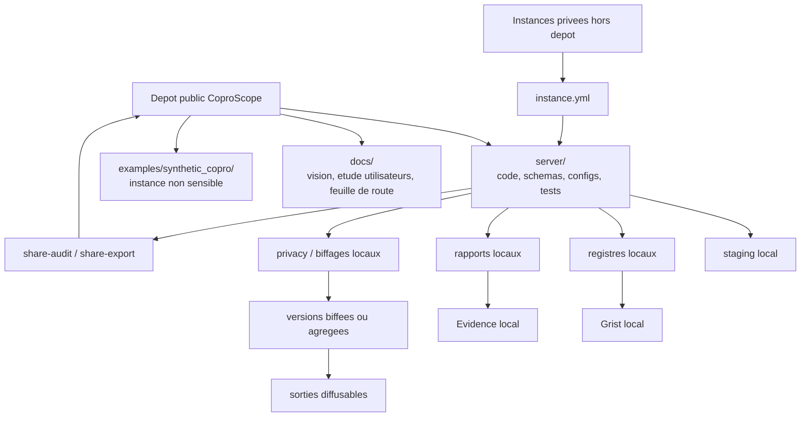
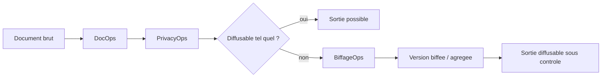

# Architecture et flux

## Vue simple

CoproScope se construit autour d'une separation stricte entre :

- le depot public ;
- les instances privees ;
- les artefacts locaux generes ;
- les sorties diffusables ou genericisables.

Cette separation permet au projet d'etre utile sur des cas reels sans publier de documents reels.

## Ce qu'on met dans le depot public

- le code genericisable ;
- les schemas et configurations par defaut ;
- les gabarits de restitution generiques ;
- les prompts, templates et tests ;
- la documentation produit ;
- l'etude utilisateurs synthetisee ;
- une instance synthetique publique ;
- des concepts UX non sensibles.

## Ce qu'on garde hors du depot public

- les instances privees reelles ;
- les documents de copropriete ;
- les exports OCR ou texte issus de pieces privees ;
- les journaux locaux d'execution ;
- les cartes de correspondance de pseudonymisation ;
- les sorties operationnelles propres a une copropriete ;
- les documents biffes s'ils restent lies a un cas reel non genericise.

## Pipeline v1

Le pipeline actuel suit cette logique :

1. bootstrap de l'etat d'instance ;
2. inventaire des documents ;
3. extraction texte ;
4. classement ;
5. screening confidentialite ;
6. file de biffage ;
7. rapport de pieces manquantes ;
8. KPI documentaires ;
9. analyse AG ;
10. synthese de diligence.

Les traitements factures/comptes, Grist et Evidence restent commandes separement pour controler leur execution et leurs preconditions.

## Place de la confidentialite

La confidentialite intervient avant les sorties diffusables.

## Place d'Audit360

Audit360 agrege les signaux des autres modules :

- pieces inventoriees ;
- demandes et reponses ;
- anomalies facture ;
- rapprochements comptables ;
- resolutions AG ;
- plus tard contrats, travaux, incidents.

Il transforme ces signaux en chaine :

`fait -> preuve -> risque -> action`.

## Arborescence utile

### `server/`

Le coeur logiciel :

- `src/coproscope/cli.py` : point d'entree CLI ;
- `src/coproscope/core/` : logique transverse, instances, partage, confidentialite ;
- `src/coproscope/modules/` : DocOps, PrivacyOps, BiffageOps, FactureOps, ComptaScope, AGOps, GristOps, EvidenceOps ;
- `src/coproscope/configs/` : configurations par defaut ;
- `src/coproscope/schemas/` : contrats de donnees ;
- `tests/` : validations automatiques.

### `docs/`

La couche de lecture humaine :

- etude utilisateurs ;
- vision produit ;
- feuille de route ;
- architecture ;
- etat du developpement ;
- confidentialite ;
- modules metier.

### `examples/synthetic_copro/`

L'instance publique de demonstration :

- aucune donnee reelle ;
- pas de secrets ;
- utile pour tests, demos et contribution.

## Choix IA actuel

Le projet reste pragmatique :

- utiliser des aides IA quand elles accelerent ;
- garder des registres locaux et auditables ;
- rendre les incertitudes visibles ;
- ne jamais transformer une sortie IA en preuve finale sans source et validation.

## Ce que cette architecture protege

- la capacite a travailler sur de vrais corpus ;
- la separation entre public et prive ;
- la reproductibilite des controles ;
- la possibilite d'une interface locale future ;
- la confiance dans les sorties diffusables.

