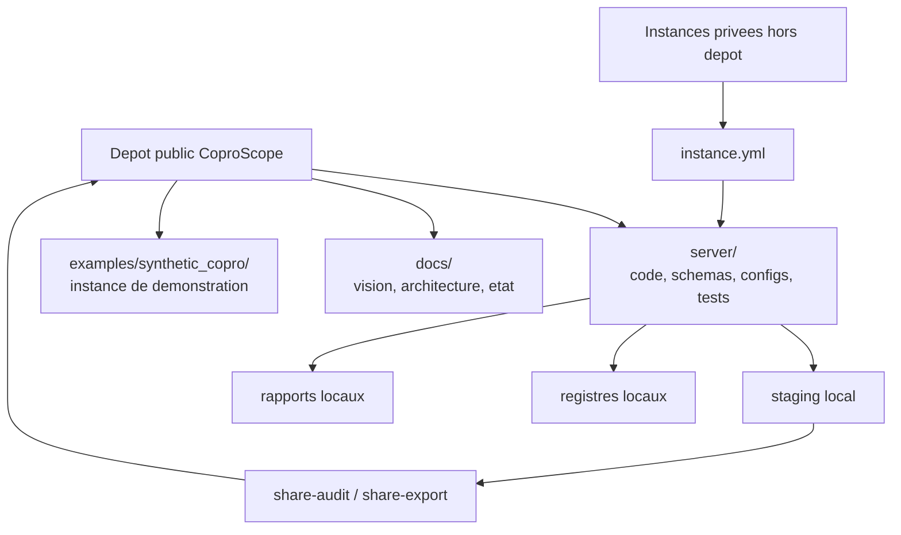

# Architecture et flux

## Vue simple

CoproScope se construit autour d'une separation stricte entre:

- le **produit public** ;
- les **instances privees** ;
- les **artefacts locaux generes**.

Cette separation est importante parce qu'elle permet au projet d'etre a la fois:

- utile sur des cas reels ;
- prudent sur les donnees ;
- publiable et relisible comme produit open source.

## Ce qu'on met dans le depot public

- le code genericisable ;
- les schemas et configurations par defaut ;
- les prompts, templates et tests ;
- une documentation qui explique le produit ;
- une instance synthetique publique pour prouver le comportement.

## Ce qu'on garde hors du depot public

- les instances privees reelles ;
- les documents de copropriete ;
- les exports OCR ou texte issus de pieces privees ;
- les journaux locaux d'execution ;
- les sorties operationnelles propres a une copropriete.

## Choix IA actuel

Le projet adopte pour l'instant une posture pragmatique:

- utiliser quand c'est utile des agents IA grand public et peu chers ;
- garder localement le maximum de briques structurantes ;
- preparer une architecture qui puisse accueillir plus tard des traitements mieux maitrises, voire hors ligne.

L'objectif n'est donc pas de rester dependant d'une IA distante. L'objectif est de construire des couches documentaires et logicielles qui rendent credible, plus tard, un deploiement sur environnement controle.

## Arborescence utile

### `server/`

Le coeur logiciel.

- `src/coproscope/cli.py` : point d'entree CLI ;
- `src/coproscope/core/` : logique transverse ;
- `src/coproscope/modules/` : modules DocOps, SyndicOps et AGOps ;
- `src/coproscope/configs/` : parametres par defaut ;
- `src/coproscope/schemas/` : contrats de donnees ;
- `tests/` : validations automatiques.

### `docs/`

La couche de lecture humaine:

- vision produit ;
- fonctions cibles ;
- etat du developpement ;
- architecture ;
- regles de partage.

### `examples/synthetic_copro/`

L'instance publique de demonstration:

- aucune donnee reelle ;
- pas de secrets ;
- utile pour tests, demos et contributions.

## Logique de flux

1. une instance declare ses racines via `instance.yml` ;
2. `coprocs` lit les documents bruts sans les modifier ;
3. le systeme ecrit seulement dans les espaces de preparation, registres, sorties et journaux ;
4. `share-audit` verifie ce qui est publiable ;
5. `share-export` construit un arbre public propre ;
6. seules les briques genericisees peuvent remonter sur GitHub.

## Ce que cette architecture essaie de proteger

- la valeur operationnelle sur des cas reels ;
- la frontiere public / prive ;
- la capacite a publier du code reusable sans fuite de donnees ;
- la possibilite pour un relecteur externe de comprendre vite ou sont les responsabilites du produit.
