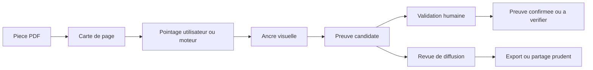

# Cadrage feature - Tracer une preuve dans un PDF

Date: 2026-05-31
Roadmap: `RM-2026-0045`
Ordre vise: `ORD-P1-043`
Chantier courant: `CH-20260531-011534-RM-2026-0045-pdf-trace-page-map`
Conversation: `CONV-2026-1912`
Statut: cadrage documentaire avant dev; code demarre trop tot et gele.

## Rectification methode

Le lancement backend du 2026-05-31 01:15 a saute une etape. La feature devait
d'abord passer par un cadrage documentaire complet: blueprint, event storming,
risques, contrat de donnees, garde-fous privacy/licence et criteres de test.

Decision de reprise:

- le code deja esquisse reste un brouillon local, non integrable;
- aucun dev UI ou backend supplementaire ne doit repartir avant validation de
  ce cadrage;
- la prochaine commande dev doit repartir de cette note, pas de l'intuition du
  module deja cree;
- la methode repo doit etre clarifiee pour toute nouvelle feature transverse.

## Probleme utilisateur

Un membre du conseil syndical lit une piece PDF et veut montrer exactement
l'endroit qui justifie une remarque, une action ou une question.

Aujourd'hui, CoproScope peut garder du texte, des pieces et des annotations
metier. Ce qui manque est le pointage visuel fiable dans la page: "ce passage
ou cette zone precise, dans cette version exacte du PDF".

La promesse a viser:

```text
Je pointe un passage dans une piece.
CoproScope garde le lien visuel et le sens metier.
Le PDF original ne change pas.
La preuve reste candidate tant qu'un humain ne l'a pas confirmee.
```

## Blueprint de service

Ce blueprint decrit le service attendu, pas encore l'ecran final.



Zones du service:

| Zone | Role | Regle simple |
|---|---|---|
| PDF source | Piece originale | Lecture seule, hash obligatoire. |
| Carte de page | Mots, pages, rectangles | Ne contient pas de chemin local. |
| Pointage | Selection texte, zone manuelle ou vision future | Produit une ancre, pas une preuve definitive. |
| Ancre visuelle | Page + rectangles + hash texte | Rejouable dans le lecteur. |
| Preuve candidate | Pourquoi ce passage compte | Validation humaine obligatoire. |
| Diffusion | Qui peut voir la trace | Bloquee si privacy non decidee. |

## Blueprint UI cible, sans dev

L'iteration UI n'est pas ouverte ici. Elle devra produire son visuel IA bitmap
et son blueprint dedie avant dev. Le squelette cible est quand meme pose pour
eviter de coder a l'aveugle.

Route cible probable:

```text
/documents/{doc_id}
```

Geste novice:

```text
Bouton: Tracer une preuve dans ce PDF
```

Ecran attendu:

| Zone ecran | Contenu attendu | Etat sensible |
|---|---|---|
| Lecteur PDF | Page lisible, zoom, navigation page | Le PDF original reste intact. |
| Outil de pointage | Selection texte si possible, rectangle manuel sinon | Le texte peut etre non confirme. |
| Panneau preuve | "Ce passage montre que..." + rattachement point/action | Preuve candidate par defaut. |
| Diffusion | Qui peut voir cette trace | CS seulement par defaut si doute. |
| Alerte hash | "Le fichier a change depuis la trace" | Ancre a verifier. |

## Event storming

L'event storming decrit ce qui se passe dans le produit. Les mots sont
volontairement simples: commande = action demandee, evenement = fait memorise.

### Commandes utilisateur

| Commande | Qui | Resultat attendu |
|---|---|---|
| Ouvrir une piece PDF | Membre CS | Le PDF et son hash sont connus. |
| Tracer une preuve dans ce PDF | Membre CS | Mode pointage actif. |
| Selectionner un passage | Membre CS ou lecteur PDF | Rectangles et court extrait candidates. |
| Encadrer une zone | Membre CS | Zone visuelle sans texte confirme. |
| Expliquer pourquoi ca compte | Membre CS | Preuve candidate rattachee a un fait/action. |
| Choisir qui peut voir | Membre CS | Decision de diffusion tracee. |
| Confirmer la preuve | Membre CS apres relecture | Preuve utilisable avec reserve. |
| Rejouer la trace | CoproScope | La page se rouvre au bon endroit. |

### Evenements memorises

| Evenement | Donnees minimales | Pourquoi |
|---|---|---|
| `document_pdf_opened` | `document_ref`, `document_hash` | Savoir quelle version est lue. |
| `pdf_text_map_built` | pages, rectangles normalises, moteur | Retrouver les mots sans chemin local. |
| `pdf_trace_selected` | page, rectangles, hash extrait | Rejouer le pointage. |
| `pdf_zone_drawn` | page, rectangle, statut texte non confirme | Gerer les scans/images. |
| `proof_candidate_created` | ancre, explication, rattachements | Garder le sens metier. |
| `proof_candidate_validated` | validateur, date, reserve | Distinguer candidat et confirme. |
| `pdf_hash_mismatch_detected` | ancien hash, nouveau hash masque | Forcer la relecture. |
| `trace_diffusion_blocked` | motif | Eviter une fuite. |

### Acteurs et objets metier

| Objet | Definition CoproScope |
|---|---|
| Piece PDF | Document source, jamais modifie par cette feature. |
| Carte de page | Representation des mots ou zones avec position. |
| Ancre visuelle | Page + rectangles + hash de contenu. |
| Trace | Ancre + commentaire + contexte metier. |
| Preuve candidate | Trace utile mais pas encore confirmee. |
| Preuve confirmee | Preuve relue, rattachee, diffusable selon regle. |
| Zone non textuelle | Rectangle image/OCR/vision sans citation sure. |

### Regles declenchees automatiquement

| Si | Alors |
|---|---|
| Le hash du PDF ne correspond plus | La trace passe en `a verifier`. |
| Le passage contient un chemin local ou un marqueur sensible | L'extrait public est masque. |
| Le PDF n'a pas de texte exploitable | CoproScope garde seulement la zone et dit `texte non confirme`. |
| Une vision IA lit une information | Elle doit renvoyer aussi la zone lue, avec confiance et statut candidat. |
| La diffusion n'est pas decidee | L'export ou partage est bloque. |
| Une annotation vient d'un moteur externe | Le moteur est cite dans `source_engine`. |

## Parcours novice

1. J'ouvre une piece.
2. Je clique sur `Tracer une preuve dans ce PDF`.
3. Je surligne un passage, ou j'encadre une zone si le PDF est scanne.
4. CoproScope me demande ce que ce passage prouve.
5. CoproScope me rappelle que ce n'est pas encore une preuve definitive.
6. Je choisis qui peut voir cette trace.
7. Plus tard, je rouvre la piece et la zone revient au meme endroit.
8. Si le fichier a change, CoproScope me dit de verifier avant usage.

No-go novice:

- l'utilisateur croit que le PDF a ete modifie;
- l'utilisateur croit que CoproScope a valide juridiquement le contenu;
- l'utilisateur voit du vocabulaire moteur: `bbox`, `pageIndex`, `rects`;
- l'utilisateur doit copier-coller un chemin local ou un nom de fichier brut.

## Contrat de donnees V1

Champs minimaux a garder cote CoproScope:

| Champ | Role | Diffusable |
|---|---|---|
| `document_ref` | Identifiant interne sans chemin local | Oui si opaque. |
| `document_hash` | Verifier la version du PDF | Oui si necessaire. |
| `page_index` | Page machine, commence a 0 | Non visible novice. |
| `page_label` | Page affichee | Oui. |
| `rects` | Rectangles normalises | Oui si sans donnees perso. |
| `selected_text_hash` | Reconnaitre le passage | Oui. |
| `selected_text_excerpt` | Court extrait filtre | Oui si privacy OK. |
| `confidence` | Confiance OCR/vision/moteur | Oui. |
| `text_status` | `confirme`, `non_confirme`, `a_verifier` | Oui. |
| `comment` | Explication humaine | Selon diffusion. |
| `point_ref` / `action_ref` / `proof_ref` | Rattachement metier | Selon diffusion. |
| `diffusion` | Public cible | Oui. |
| `source_engine` | PyMuPDF, Zotero adapter, vision, manuel | Oui. |

Donnees interdites dans payload public:

- chemin local;
- nom de fichier brut sensible;
- OCR brut long;
- table d'alias vers identites reelles;
- token, secret, URL locale;
- extrait long d'une piece privee.

## Architecture cible

Architecture recommandee:

```text
Lecteur PDF ou moteur de page
        |
        v
Adaptateur de pointage
        |
        v
Trace sidecar CoproScope
        |
        v
Preuve candidate + diffusion
```

Choix propose:

| Option | Verdict | Raison |
|---|---|---|
| Copier Zotero reader entier | No-go V1 | Trop lourd, obligations AGPL et maintenance. |
| Adapter inspire Zotero | GO cadrage | Bon modele de position sans remplacer CoproScope. |
| PDF.js + modele CoproScope | Option ouverte | Moins de couplage, plus de dev selection. |
| Extraction texte seule | Insuffisant | Donne le contenu mais pas toujours le geste visuel. |
| Vision seule | Insuffisant | Utile pour scans, mais doit rester candidate. |

## Lecture texte, OCR et vision

Pour un PDF texte, la position peut souvent etre deduite sans IA vision:
les mots ont des coordonnees dans la page. CoproScope peut donc produire une
carte de page et retrouver un passage.

Pour un scan ou une page image, il faut OCR ou vision. Si une lecture vision est
mobilisee, elle doit rendre deux choses en meme temps:

- l'information lue;
- la position dans la page qui justifie cette lecture.

Sans position, la lecture vision est moins utile pour CoproScope: elle cree une
information, mais pas une preuve rejouable.

## Licence et dependances

CoproScope est en `AGPL-3.0-only`. Zotero reader est sous AGPL d'apres les
sources officielles consultees dans la note d'exploration.

Consequence:

- la compatibilite est meilleure qu'avant;
- reprendre du code Zotero oblige quand meme a garder notices, source et traces
  de modification;
- une V1 doit eviter la copie de code et documenter l'adaptateur;
- toute reprise directe de Zotero devra passer par une decision d'architecture
  separee.

## Tests d'acceptation

Tests obligatoires avant integration technique:

| Test | Attendu |
|---|---|
| PDF texte fictif | Une phrase est retrouvee et ancree. |
| Reouverture | Le surlignage revient au meme endroit. |
| Hash original | Le PDF source n'a pas change. |
| Hash modifie | La trace passe en `a verifier`. |
| Chemin local dans texte | L'extrait public est masque. |
| PDF scanne | Zone gardee, texte `non confirme`. |
| Diffusion absente | Export bloque. |
| UI novice | Aucun jargon technique visible. |

## Risques et parades

| Risque | Effet | Parade |
|---|---|---|
| Mauvais rectangle | Preuve inutilisable | Tests sur zoom, rotation, multi-pages. |
| Confusion candidat/confirme | Surconfiance | Libelle `preuve candidate` par defaut. |
| Fuite de texte brut | Donnee privee exposee | Extrait court filtre + PrivacyOps. |
| PDF modifie | Perte probatoire | Hash avant/apres, lecture seule. |
| Couplage Zotero trop fort | Dette maintenance | Adaptateur mince et notices si code repris. |
| Vision trop affirmative | Erreur non vue | Confiance + validation humaine. |
| UI trop technique | Novice perdu | Wording simple, pas de `rects`/`bbox`. |

## Questions ouvertes

1. Le premier prototype doit-il etre un lecteur reel cliquable ou une brique
   interne testee sur cartes de mots fictives?
2. Quel lecteur PDF local est retenu pour l'UI: composant inspire Zotero,
   PDF.js, ou autre lecteur deja present?
3. Le statut `preuve confirmee` demande-t-il une validation par une ou plusieurs
   personnes?
4. Quelle limite exacte pour l'extrait public: nombre de caracteres, mots, ou
   regle differente selon confidentialite?
5. Faut-il creer un registre dedie `trace_pdf` ou enrichir le registre
   d'annotations existant?

## Gate avant reprise dev

Le dev peut reprendre seulement si les points suivants sont vrais:

- ce cadrage est relu ou accepte;
- le choix V1 est confirme: adaptateur sidecar, pas remplacement DocOps;
- l'iteration code est bornee a une brique interne ou a une UI cible explicite;
- les tests ci-dessus sont retenus;
- les brouillons deja crees sont relus comme drafts, pas integres par inertie;
- si l'iteration devient UI, un visuel IA bitmap et un blueprint UI dedie sont
  produits puis qualifies par novice avant dev.
