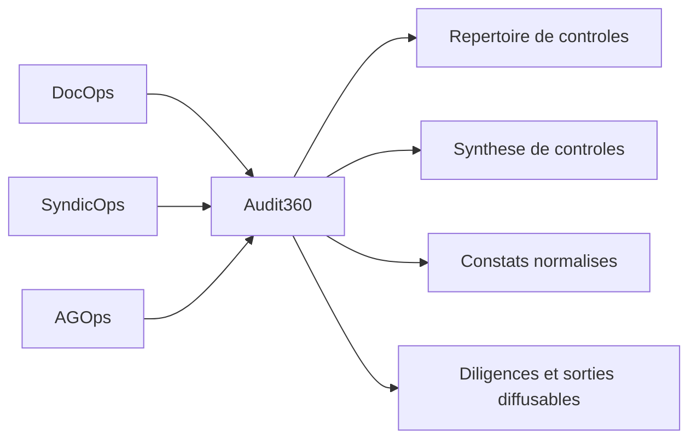

# Audit360

## Pourquoi cette brique compte

`Audit360` n'est pas un module decoratif pose a cote du reste.

C'est la couche transverse qui transforme:

- des pieces documentaires ;
- des demandes syndic ;
- des elements d'AG ;
- des sujets travaux, contrats ou sinistres ;

en matiere pilotable:

- constats normalises ;
- points de controle ;
- preuves attendues ;
- actions a faire ;
- diligences et suivis.

Autrement dit, si DocOps dit "voici les pieces" et si SyndicOps / AGOps disent "voici les relations et les situations", `Audit360` aide a dire "voici ce qu'il faut verifier, pourquoi, avec quelle preuve, et quelle suite donner".

## Ce qui est generalisable

La partie publiable d'`Audit360` ne reside pas dans les constats d'une instance pilote elle-meme.

Elle reside dans les **formes** et les **mecanismes** reutilisables:

- une chaine simple `fait -> preuve -> regle -> action` ;
- des constats normalises au lieu de notes disparates ;
- un repertoire de controles consolidant des constats heterogenes ;
- une synthese par point de controle ;
- une distinction claire entre source, appreciation, risque, preuve attendue et action ;
- des sorties assez structurees pour etre relues, filtrees, discutees et diffusees proprement.

## Ce qui reste prive

Ne remontent pas sur GitHub:

- les constats reels ;
- les fichiers sources de copropriete ;
- les noms propres, lots, entreprises ou montants issus d'une instance reelle ;
- les extractions texte privees ;
- les arbitrages locaux encore trop specifiques a une copropriete.

Le depot public n'accueille que la grammaire reutilisable d'`Audit360`, jamais la substance sensible d'une instance.

## Place dans CoproScope

`Audit360` n'efface pas les autres briques. Il s'appuie sur elles.

## Artefacts publics ajoutes

Cette extraction publique s'inscrit maintenant dans le depot via:

- des gabarits CSV dans [`server/src/coproscope/templates/`](../server/src/coproscope/templates/) ;
- des schemas JSON dans [`server/src/coproscope/schemas/`](../server/src/coproscope/schemas/) ;
- cette note de cadrage pour expliciter le role de la brique.

Les premiers artefacts exposes sont:

- `repertoire_controles.csv`
- `synthese_controles.csv`
- `constats_normalises.csv`

Ils ne contiennent aucune donnee reelle. Ils montrent simplement la forme commune que CoproScope peut viser pour rendre des audits relisibles et partageables.

## Ce que cela change pour le projet

Remettre `Audit360` dans la doc clarifie deux choses importantes:

1. CoproScope n'est pas seulement un moteur de classement documentaire.
2. La generalisation ne porte pas uniquement sur des scripts, mais aussi sur des modeles de lecture, de preuve et de restitution.

En pratique, cela redonne une place visible a la dimension "controle, constat, diligence" sans casser la priorite actuelle:

1. DocOps d'abord ;
2. SyndicOps ensuite ;
3. AGOps ensuite ;
4. `Audit360` comme couche transverse qui se nourrit de ces briques et en structure les sorties.
