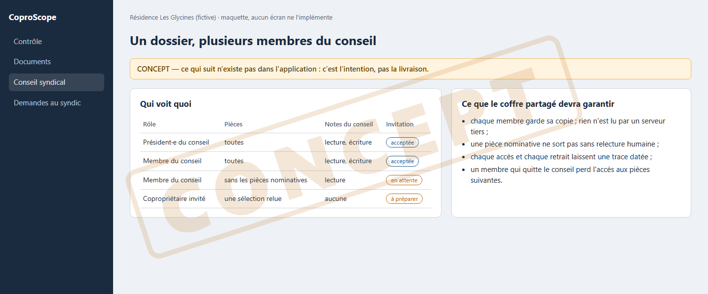

# Concept : plusieurs membres du conseil, un coffre partagé

**Statut : concept. L'écran « Droits et rôles » et l'écran « Coffre et partage »
ont été retirés lors de la recette du 2026-09-13 (`RM-2026-0183`).**

## L'idée

Un conseil syndical, c'est plusieurs personnes. Chacune devrait pouvoir lire le
même dossier, avec des droits différents (lire, annoter, conclure), sans que les
pièces quittent le poste de leur détenteur en clair.

## Pourquoi il n'y a plus d'écran

Les écrans existaient, mais ils promettaient un partage que rien ne réalisait
de bout en bout. Un écran qui montre un réglage sans effet réel trompe
l'utilisateur. Le code métier utile (modèle d'accès, rôles) est gardé sans écran.

## Ce qu'il faudrait pour le construire

- une identité locale par membre, sans compte en ligne obligatoire ;
- un paquet chiffré par destinataire ([synchronisation chiffrée](concept-synchro-drive.md)) ;
- une trace de qui a conclu quoi, distincte de ce que la machine constate.

## Notes liées

- [Carte des notes](carte.md)
- [Synchronisation chiffrée](concept-synchro-drive.md)
- [Confidentialité](confidentialite.md)
- [Feuille de route](feuille-de-route.md)
