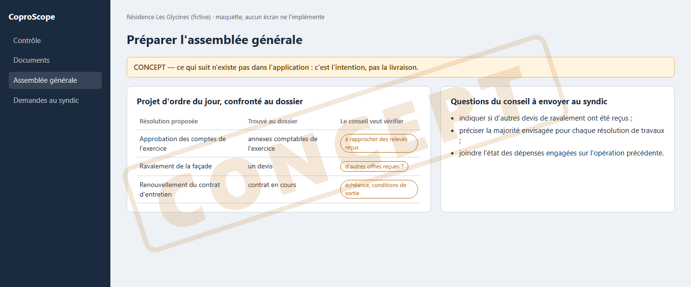

# Concept : préparer une assemblée générale

**Statut : concept. Les écrans « Atelier AG », « Participants AG », « Comptes
rendus du conseil » et « Rôles des commissions » ont été retirés lors de la
recette du 2026-09-13 (`RM-2026-0183`).**

## L'idée

Avant une assemblée, le conseil syndical relit la convocation, compare avec
l'assemblée précédente, repère ce qui touche le portefeuille des
copropriétaires et prépare ses questions.

## Pourquoi il n'y a plus d'écran

Ces écrans mélangeaient une matière réelle et des exemples, sans que
l'utilisateur puisse savoir lequel il regardait. Ce qui existe et tient —
lecture des résolutions, contrôle de gouvernance — vit dans
[Contrôle](fonction-controle.md).

## Ce qu'il faudrait pour le construire

- la comparaison nommée entre deux assemblées (documents, dates, montants) ;
- la traduction des montants en conséquences pour les copropriétaires ;
- des questions au syndic préparées, jamais envoyées automatiquement.

## Notes liées

- [Carte des notes](carte.md)
- [Contrôle des comptes et de la gouvernance](fonction-controle.md)
- [Feuille de route](feuille-de-route.md)
