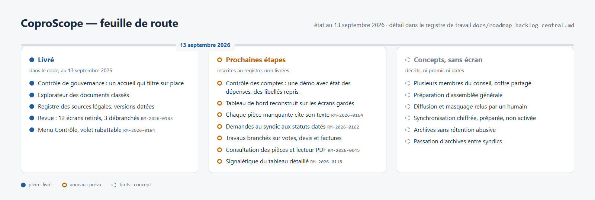

# Feuille de route

La feuille de route vivante du projet est le registre
[`docs/roadmap_backlog_central.md`](../roadmap_backlog_central.md) : chaque sujet
y porte un identifiant `RM-…`, un statut et ses preuves. Cette note en donne la
lecture courte ; la frise en reprend l'essentiel.

## Fait en septembre 2026

- **Revue de l'application du 2026-09-13** (`RM-2026-0183`) : douze écrans retirés
  et trois débranchés, écran par écran ; un seul menu Contrôle à deux onglets ; une
  démo fictive branchée.
- **Volet de gauche rabattable** (`RM-2026-0184`).
- **Explorateur des documents classés**, sans document perdu faute de classement.
- **Accueil du contrôle de gouvernance** qui filtre sur place, avec deux signes
  distincts pour « établi par les pièces » et « l'outil ne sait pas encore ».
- **Le droit jusque dans le code** : registre des sources avec version et date de
  lecture, garde qui balaie tout le code ([note](ancrage-reglementaire.md)).

## Prochaines étapes

| Sujet | Référence |
|---|---|
| Vider le tableau de bord et le reconstruire à partir des écrans gardés | `RM-2026-0183` |
| Chaque pièce manquante dit quel texte l'exige | `RM-2026-0164` |
| Une demande au syndic sait où elle en est | `RM-2026-0162` |
| Brancher l'écran Travaux sur les résolutions, devis et factures | `RM-2026-0183` |
| Refaire la page de consultation des pièces et le lecteur PDF | `RM-2026-0182`, `RM-2026-0045` |
| Harmoniser la signalétique du tableau détaillé | `RM-2026-0118` |

## Plus tard, à l'état de concept

- [Multi-utilisateur et coffre partagé](concept-multi-utilisateur-coffre-partage.md) — voir aussi `RM-2026-0177`
- [Synchronisation chiffrée](concept-synchro-drive.md) — voir aussi `RM-2026-0179`
- [Préparation d'assemblée générale](concept-preparation-ag.md)
- [Diffusion et masquage](concept-diffusion-masquage.md) — `RM-2026-0176`
- [Archives détenues par un tiers](concept-archives-anti-retention.md)
- [Passation d'archives entre syndics](concept-passation-syndics.md)

## Notes liées

- [Carte des notes](carte.md)
- [Tableau de bord et chantiers](fonction-a-construire.md)
- [Soutenir le projet](soutenir.md)
