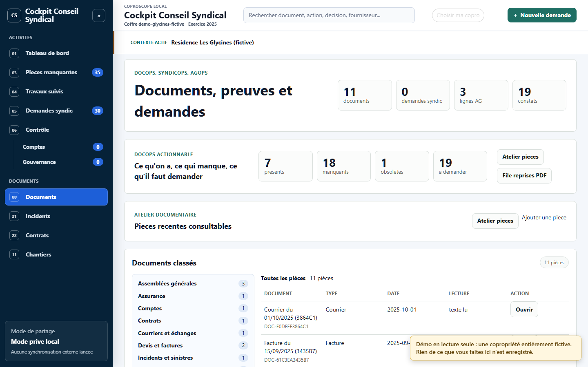

# Documents classés

L'écran **Documents** est un explorateur : à gauche, les familles de pièces
(procès-verbaux, devis, factures, contrats…) puis les exercices ; à droite, la
liste des documents avec leur type, leur date et leur état de lecture.

## Ce qui est garanti

- **Aucun document n'est perdu faute de classement.** Un document que la chaîne
  n'a pas su classer apparaît dans « Non classés », il ne disparaît pas.
  Une garde automatique vérifie que chaque document du registre apparaît une
  fois, et une seule, dans l'arbre.
- **Une famille inconnue reste visible.** Si un syndic envoie une nature de pièce
  que l'outil ne connaît pas, elle apparaît comme « Famille non reconnue » au
  lieu d'être rangée ailleurs en silence.

## Comment les documents arrivent

Les pièces transmises par le syndic (PDF à texte, principalement) sont lues par
une chaîne locale : inventaire, empreinte, extraction du texte, classement,
complétude. Les registres affichés sont **reconstruits** depuis ces pièces ; ils
ne sont pas saisis à la main.

Sur la démo, le haut de la page affiche encore des compteurs qui ne concordent pas avec
le menu (pièces manquantes, demandes) et une mention « Ajouter une pièce », inactive : ce sont des
restes de l'ancienne page, à reprendre avec le tableau de bord.

## Ce qui reste à faire

- Le lecteur PDF intégré doit être repris : citation qui ouvre la bonne page,
  défilement fiable.
- L'ajout d'un document depuis l'interface est débranché pour l'instant.

## Notes liées

- [Carte des notes](carte.md)
- [Contrôle des comptes et de la gouvernance](fonction-controle.md)
- [Architecture](architecture.md)
- [Confidentialité](confidentialite.md)
