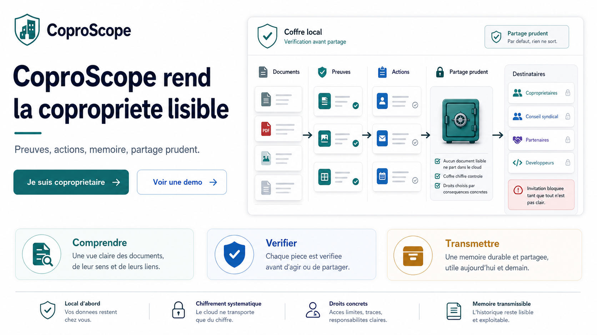
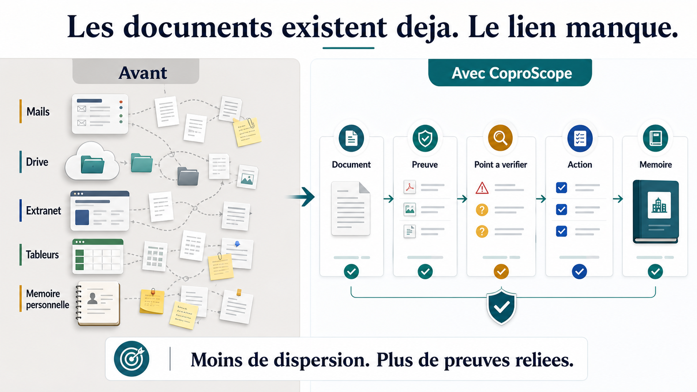
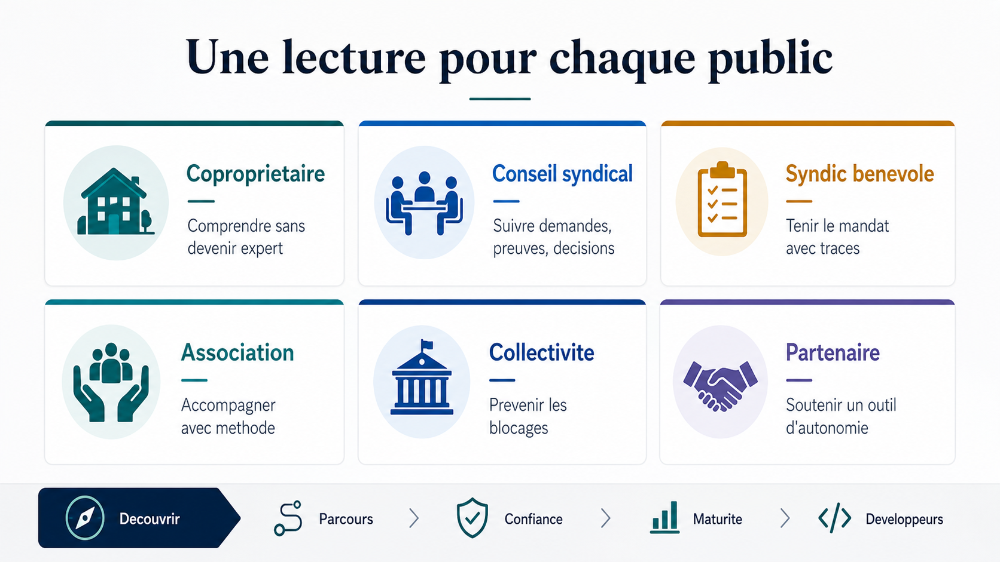
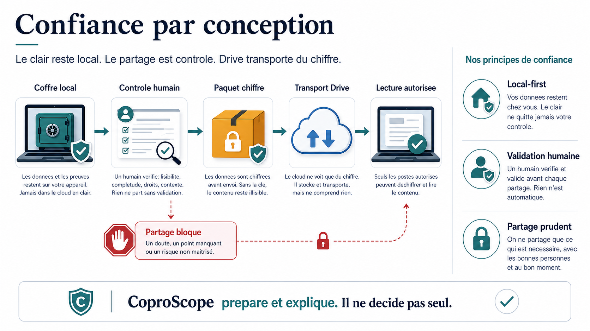
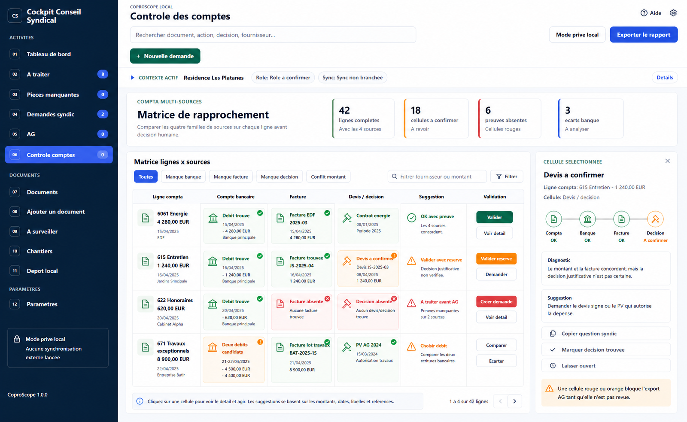
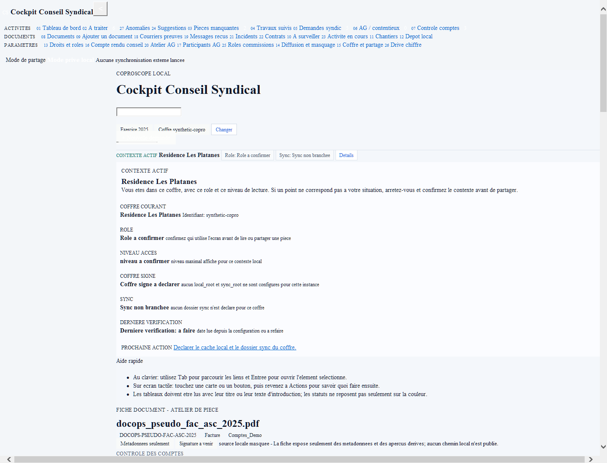
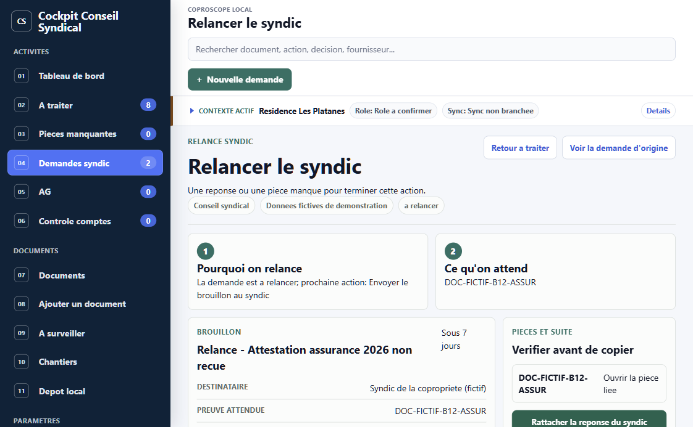
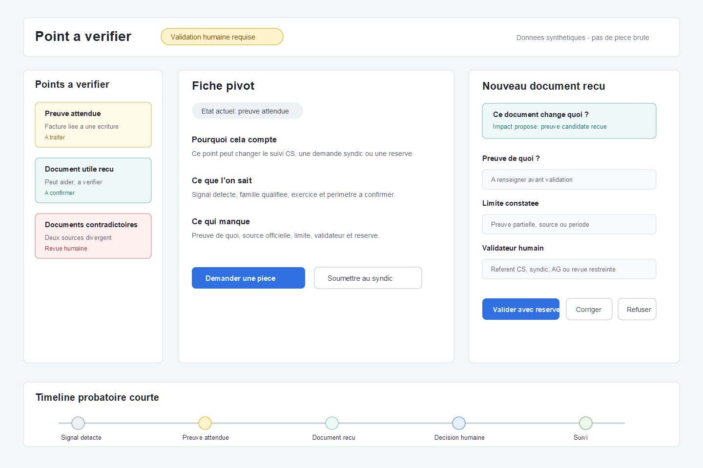
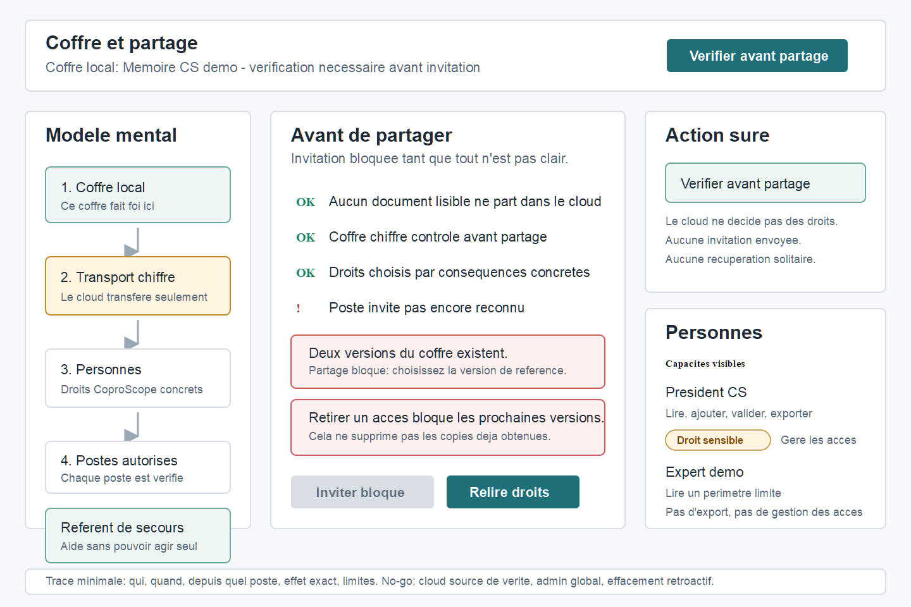
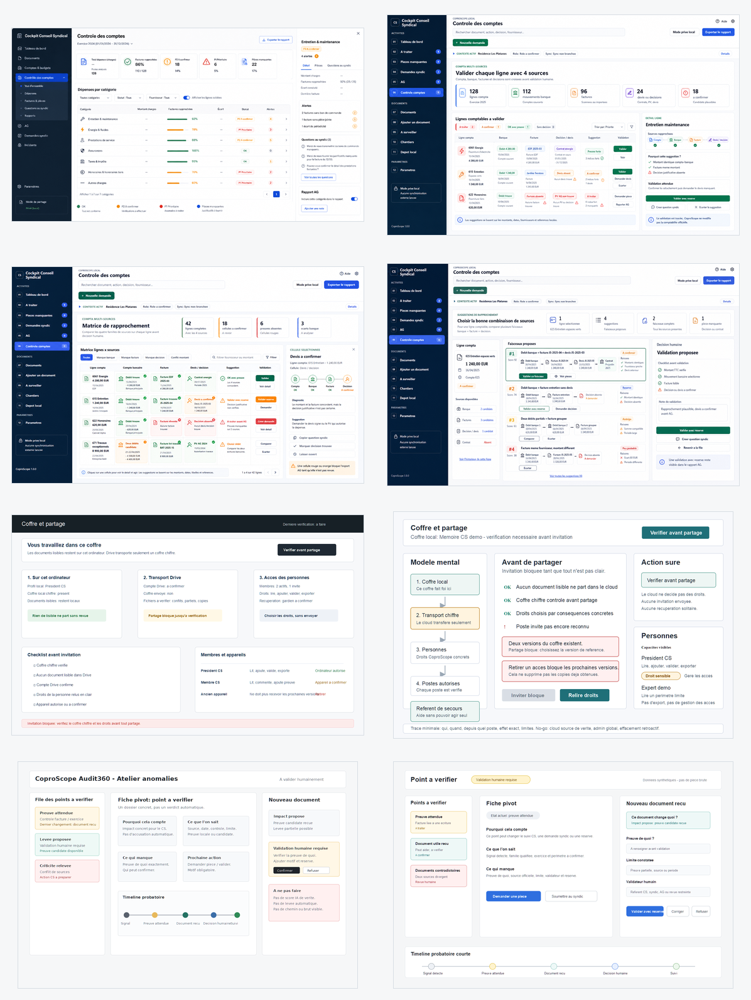

# Galerie Visuelle

Navigation:
[README GitHub](../../README.md) |
[Decouvrir](./README.md) |
[Parcours](./parcours-demonstratifs.md) |
[Supports ecran](./supports-ecran.md) |
[Drive et confidentialite](./confiance-confidentialite.md) |
[Sponsors](./sponsors-et-partenaires.md) |
[Maturite](./maturite-et-limites.md) |
[Index docs](../README.md)

Cette page rassemble les visuels a montrer en priorite dans GitHub, en reunion
ou dans un support de demonstration. Les images sont choisies pour expliquer
CoproScope sans jargon: probleme, preuve, action, memoire et partage prudent.

## Vitrine 16:9

Ces quatre images servent a presenter CoproScope sur ordinateur, PDF horizontal
ou diaporama.

| Ecran | Visuel | Message |
|---|---|---|
| Accueil |  | Promesse centrale: rendre les preuves, actions et transmissions lisibles. |
| Probleme |  | Les pieces existent, mais elles restent dispersees et peu actionnables. |
| Publics |  | Chaque auditoire a une entree simple: habitant, conseil syndical, association, collectivite, partenaire. |
| Confiance |  | Le clair reste local, le partage est controle et Drive transporte du chiffre. |

## Captures Produit Retenues

Ces captures montrent la matiere produit la plus concrete. Elles sont plus
utiles qu'une promesse: elles montrent ce que CoproScope essaie de rendre
visible.

| Parcours | Capture | Ce que l'on comprend |
|---|---|---|
| Controle des comptes |  | Une ligne n'est pas validee au feeling: on voit les sources, les absences, les reserves et la prochaine question. |
| Preuve contextualisee |  | Une piece doit rester rattachee a un sujet, une limite et une action. |
| Demande et relance |  | Une piece absente devient une demande suivie, avec preuve attendue et trace. |
| Point a verifier |  | Un signal ne devient pas un verdict automatique: il reste ouvert tant que la preuve n'est pas solide. |
| Coffre et partage |  | Le partage est bloque si le clair, les droits ou la version de reference ne sont pas controles. |

## Vue D'Ensemble

Ouvrir la planche:
[planche des parcours P0](../assets/showcase/planche-parcours-p0.png)

La planche sert a relier les parcours entre eux. Elle est utile pour une revue
produit, moins pour un premier contact public. Pour un sponsor ou un futur
utilisateur, commencer par les visuels 16:9 puis ouvrir les captures produit.

## Usage Recommande

| Usage | Visuels a privilegier |
|---|---|
| README GitHub | Accueil, probleme, comptes, preuve, coffre. |
| Revue sponsor | Probleme, publics, confiance, coffre. |
| Demo utilisateur | Comptes, preuve, demande, point a verifier. |
| Presentation ecran | Les quatre images 16:9 puis une capture produit par parcours. |

Pour preparer un diaporama ou un PDF horizontal, lire aussi:
[Supports ecran et carrousel](./supports-ecran.md).
