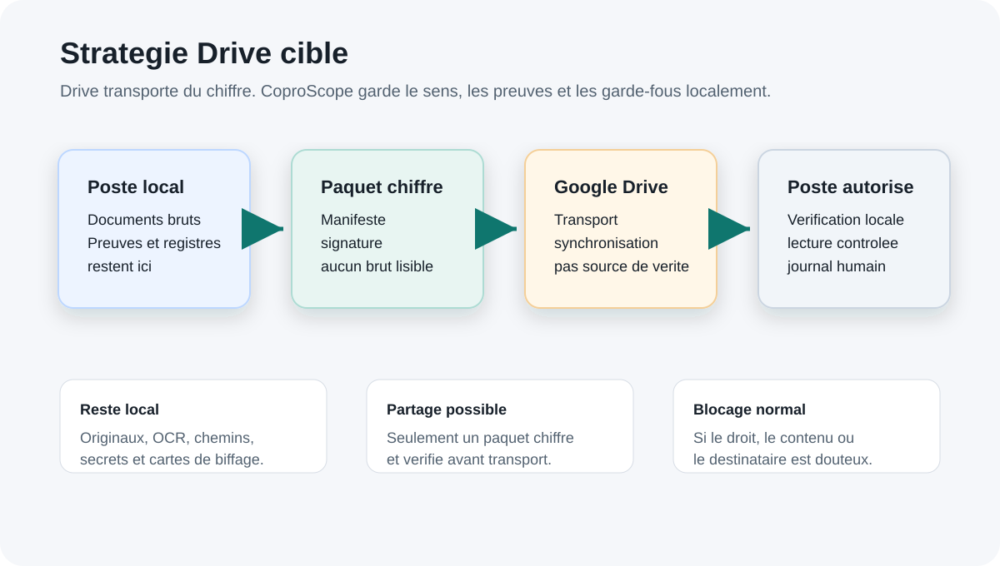
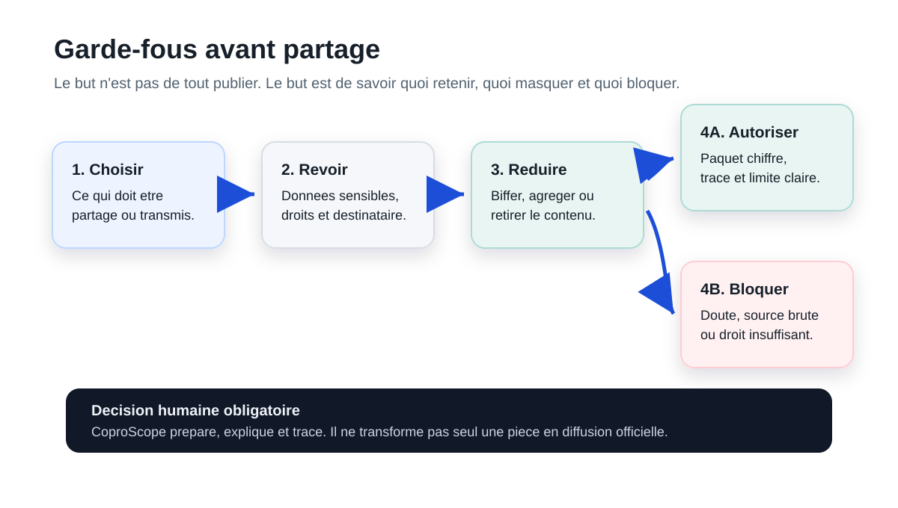

# Vitrine Markdown CoproScope

Navigation:
[README GitHub](../../README.md) |
[Index docs](../README.md) |
[Decouvrir](./README.md) |
[Parcours](./parcours-demonstratifs.md) |
[Drive et confidentialite](./confiance-confidentialite.md) |
[Sponsors](./sponsors-et-partenaires.md) |
[Maturite](./maturite-et-limites.md) |
[Developpeurs](../developpeurs/README.md)

## Promesse

CoproScope transforme un dossier de copropriete opaque en preuves, actions et
memoire transmissible.

Le produit s'adresse d'abord a des personnes qui ne sont pas specialistes:
coproprietaires, conseils syndicaux, syndics benevoles, associations,
collectivites et partenaires.

## Strategie Drive Cible

Drive est utile pour circuler entre plusieurs personnes. CoproScope doit eviter
qu'il devienne un vrac de documents sensibles.

Ouvrir l'infographie:
[strategie cible Drive](../assets/showcase/drive-strategie-cible.svg)

Le principe:

1. le coffre local garde les documents clairs;
2. CoproScope controle ce qui peut etre prepare;
3. le paquet est chiffre avant envoi;
4. Drive sert de transport, pas de source de verite;
5. la lecture se fait apres verification locale.

Ouvrir l'infographie:
[garde-fous avant partage](../assets/showcase/drive-garde-fous-partage.svg)

## Parcours A Montrer

### Controler Les Comptes

Ouvrir le visuel:
[controle des comptes](../assets/showcase/controle-comptes-matrice.png)

CoproScope aide a voir les sources disponibles, les sources absentes et les
questions a poser avant une assemblee generale.

### Ouvrir Une Preuve

Ouvrir le visuel:
[preuve document PDF](../assets/showcase/preuve-document-pdf.png)

Une preuve doit dire ce qu'elle prouve, ce qu'elle ne prouve pas, et pourquoi
elle est rattachee a une action, une depense ou un point.

### Demander Et Relancer

Ouvrir le visuel:
[parcours demande et relance](../assets/showcase/parcours-demande-relance.png)

Une absence de piece devient une demande suivie, puis une preuve attendue.

### Transformer Un Signal En Point A Verifier

Ouvrir le visuel:
[point a verifier](../assets/showcase/point-a-verifier-validation.png)

Un signal n'est pas un verdict automatique. Il ouvre un point a verifier.

## Lecture Par Profil

| Profil | Lire |
|---|---|
| Grand public | [Decouvrir CoproScope](./README.md) |
| Futur utilisateur | [Parcours demonstratifs](./parcours-demonstratifs.md) |
| Sponsor ou partenaire | [Sponsors et partenaires](./sponsors-et-partenaires.md) |
| Lecteur inquiet sur Drive | [Strategie Drive et confidentialite](./confiance-confidentialite.md) |
| Lecteur qui veut l'etat reel | [Maturite et limites](./maturite-et-limites.md) |
| Developpeur | [Documentation developpeurs](../developpeurs/README.md) |

## Maturite Reelle

| Bloc | Etat |
|---|---|
| Interface locale | V0 utile: actions, comptes, demandes, documents, preuves et passation. |
| DocOps | Inventaire, hash, extraction, classement et completude. |
| PrivacyOps / BiffageOps | Revue, biffage et garde-fous avant partage. |
| ComptaScope | Rapprochements candidats, sources absentes et questions guidees. |
| Drive chiffre | Cap cible clair; parcours complet encore a stabiliser. |
| Installation noob | Cible documentee, pas encore experience finale. |

## Pages Connexes

- [README GitHub](../../README.md)
- [Index documentation](../README.md)
- [Decouvrir CoproScope](./README.md)
- [Parcours demonstratifs](./parcours-demonstratifs.md)
- [Strategie Drive et confidentialite](./confiance-confidentialite.md)
- [Sponsors et partenaires](./sponsors-et-partenaires.md)
- [Maturite et limites](./maturite-et-limites.md)
- [Documentation developpeurs](../developpeurs/README.md)
