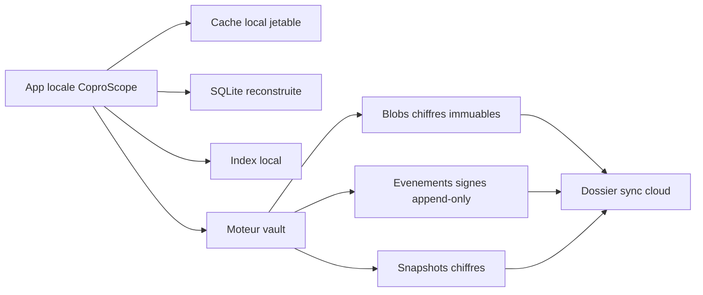

# Transition vers un vault collaboratif signe

## Objectif

Faire evoluer CoproScope d'un cockpit local-first fonde sur des registres et exports vers un modele collaboratif facon vault: local obligatoire, sync par dossier chiffre, historique append-only, signatures verifiables et plugins officiels.

## Decisions structurantes

- L'app travaille dans une copie locale, jamais directement dans un dossier cloud.
- Le cloud transporte uniquement le vault chiffre.
- L'etat metier est reconstruit depuis les evenements signes.
- Les CSV, Markdown, PDF et bases analytiques deviennent des exports derives.
- Les traitements lourds deviennent des plugins officiels signes.
- Obsidian est une inspiration produit et interop possible, pas un moteur embarque.

## Lecons retenues d'Obsidian

- Local-first d'abord: la copie locale est le centre de gravite, la sync est un transport.
- Historique et conflits doivent etre natifs: ne pas attendre le multi-poste pour modeliser les divergences.
- Les primitives de donnees tres utilisees finissent dans le noyau: les documents, proprietes, bases, taches et liens probatoires doivent etre natifs.
- Les plugins accelerent l'usage, mais creent une surface de risque: signature, compatibilite, permissions et revocation sont indispensables.
- L'import/migration est une experience produit: Drive vers local vers vault doit etre auditable et relancable.

Sources de contexte:

- Obsidian 1.0: https://obsidian.md/changelog/2022-10-13-desktop-v1.0.0/
- Canvas 1.1: https://obsidian.md/changelog/2022-12-05-desktop-v1.1.0/
- Properties 1.4: https://obsidian.md/changelog/2023-07-26-desktop-v1.4.0/
- Bases 1.9.10: https://obsidian.md/changelog/2025-08-18-desktop-v1.9.10/
- Sync security: https://obsidian.md/help/sync/security
- Version history: https://obsidian.md/help/Obsidian%2BSync/Version%2Bhistory
- Plugin security: https://obsidian.md/help/plugin-security

## Architecture cible

## Surface V1

- `coprocs vault init --local-root ... --sync-root ...`
- `coprocs vault import --path ...`
- `coprocs vault status`
- `coprocs vault verify`
- `coprocs vault snapshot`

## Controle transport et resilience

La sync reste un transport non fiable, meme quand elle est locale et pratique.
Le produit doit separer trois controles:

- pre-vol profil sync: conflits provider, placeholders, fichiers partiels,
  metadata de moteur sync, liens symboliques et collisions de casse;
- verification cryptographique: signatures, hashes, chainage par appareil,
  blobs references et snapshots;
- survivability: quorum de recuperation, gardien coproprietaire, replique
  lecteur, archive complete verifiable et absence de dependance exclusive au
  conseil syndical.

Un dossier peut donc etre "synchronise" mais non exploitable, ou verifiable
cryptographiquement mais fragile en passation si les cles et les repliques ne
sont pas assez distribuees.

## Regle de confidentialite

Le dossier sync ne revele jamais:

- le nom reel d'un document;
- le contenu lisible d'une piece;
- un chemin utilisateur;
- un nom de copropriete;
- un index de recherche lisible;
- un cache dechiffre.

## Roadmap

- Sprint 0: bascule locale, passation, batchs et nettoyage controle.
- Sprint 1: specifications vault, evenements et plugins.
- Sprint 2: prototype `vault init/import/status/verify/snapshot`.
- Sprint 3: reconstruction SQLite, identites et conflits.
- Sprint 4: atelier piece, point, action, preuve.
- Sprint 5: sync dossier cloud entre deux copies locales, avec audit de
  transport avant import et tests de conflit/placeholders/partiels.
- Sprint 6: plugins officiels signes.
- Sprint 7: packaging desktop et mises a jour signees.
